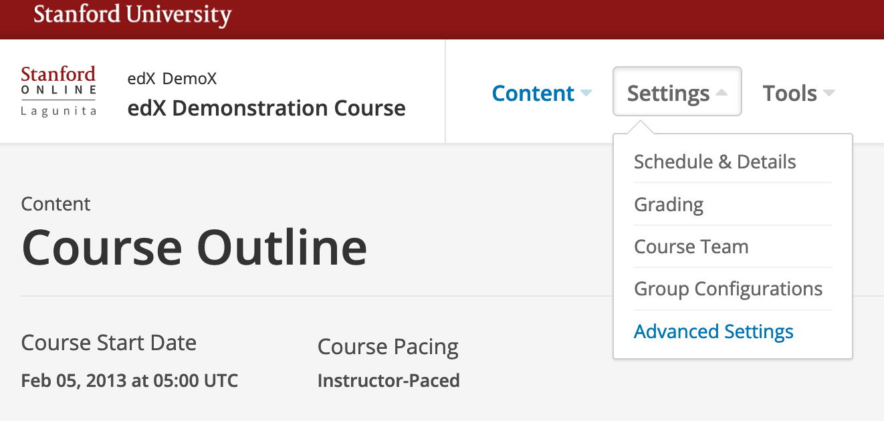
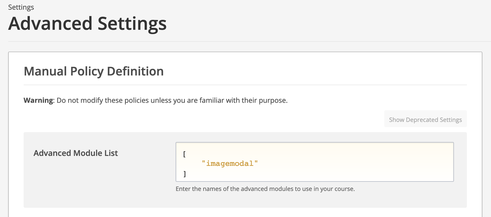
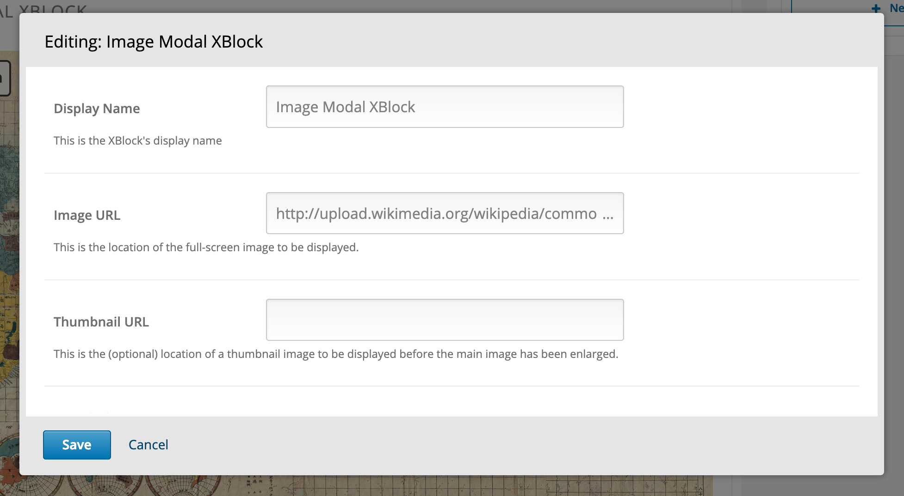
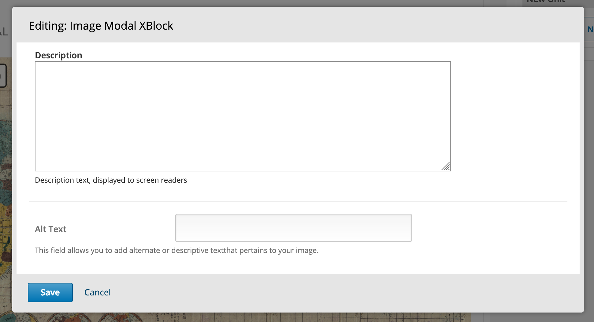

Image Modal XBlock
==================
A fullscreen image modal XBlock.

This package is meant to be installed within the OpenEdX platform.

Installation, system administrator
----------------------------------

To install the XBlock on your platform,
add the following to your `requirements.txt` file:

    xblock-image-modal

You'll also need to add this to your `INSTALLED_APPS`:

    imagemodal

Installation, course staff
--------------------------

To install the XBlock in your course,
access your `Advanced Module List`:

    Settings -> Advanced Settings -> Advanced Module List

and add the following:

    imagemodal

like:

    [
        "imagemodal"
    ]

Usage, Course Staff
-------------------

Using the Studio editor, you can edit the following fields:

- display name
- image URL
- thumbnail URL
- description
- alt text

